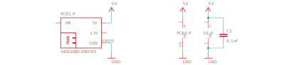
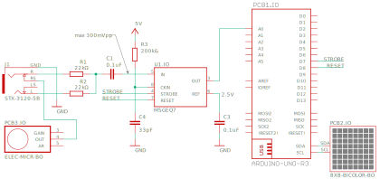
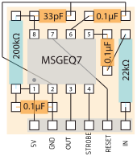
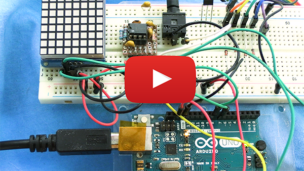

# MSGEQ7_8x8matrix

[](https://github.com/cvonk/MSGEQ7_8x8matrix/discussions)


## Clone

Clone the repository and its submodules to a local directory. The `--recursive` flag automatically initializes and updates the submodules in the repository.

```bash
git clone --recursive https://github.com/cvonk/MSGEQ7_8x8matrix.git
```

or using `ssh`
```bash
git clone --recursive git@github.com:cvonk/MSGEQ7_8x8matrix.git
```

## Hardware

This project uses input from headphone input or amplified microphone and outputs to a 8x8 bicolor matrix.

### Schematic

Power



Logic



A few notes:
- The 200 kΩ resistor is not an E12-series value. You can also make an equivalent value by 220 kΩ and 2.2 MΩ in parallel, or put two 100 kΩ in series.
- I put the MSGEQ7 and its glue on a piece of proto board.  
  

### Bill of materials

| Name | Description | Suggested mfr and part# | Paid |
|------|-------------|-------------------------|-----:|
| PCB1 | Arduino Uno R3 or compatible | Adafruit 2488 | [$17.50](https://www.adafruit.com/product/2488)
| PCB2 | Bicolor LED Square Pixel Matrix w/ I2C breakout | Adafruit 902 | [$15.95](https://www.adafruit.com/product/902)
| PCB3 | Electret microphone w/ auto gain control | Adafruit 1713 | [$7.95](https://www.adafruit.com/product/1713)
| U1 | Seven Band Graphic Equalizer Display Filter | MSI MSGEQ7 | [$5.50](https://www.digikey.com/en/products/detail/sparkfun-electronics/COM-10468/5806591)
| J1 | Headphone jack stereo connector, 3.5mm, kinked pin | Kycon STX-3120-5B | [$0.74](https://www.digikey.com/en/products/detail/kycon-inc/STX-3120-5B/9990114)
| R1, R2 | Resistor, 22 kOhm, 1%, 1/8 W, 0805 | Yageo RC0805FR-0722KL | [$0.10](https://www.digikey.com/en/products/detail/yageo/RC0805FR-0722KL/727736)
| R3 | Resistor, 200 kOhm, 1%, 1/8 W, 0805 | Yageo RC0805FR-07200KL | [$0.10](https://www.digikey.com/en/products/detail/yageo/RC0805FR-07200KL/7277240)
| C1, C2, C3 | Ceramic capacitor, 0.1 µF, 25V, 0805 | KEMET C0805C104M3RACTU | [$0.10](https://www.digikey.com/en/products/detail/kemet/C0805C104M3RAC7800/2211748)
| C4 | Ceramic capacitor, 33 pF, 50V, 0805 | KEMET C0805C330J5GAC7800 | [$0.10](https://www.digikey.com/en/products/detail/kemet/C0805C330J5GAC7800/411114)

### Notes

The popular Arduino UNO R3 forms the heart of the system. This board is now getting hard to find, but you can also use the Arduino METRO 328 or any other equivalent boards.

For the microphone, I use the Adafruit microphone breakout, because includes an automatic gain control. Other microphones will work for as long as the output signal is strong enough.

## Software

The implementation changes the sound wave to an electrical signal; uses autocorrelation to find frequency played; display frequency as note on screen while sending to a MIDI synthesizer.

### Requirements

| Component | Version tested |
|-----------|----------------|
| Arduino IDE | 1.8.19 (&ge; 1.6.12)
| Arduino AVR Boards | 1.8.5 (&ge; 1.6.14)
| Adafruit LED Backpack library | 1.3.2
| Adafruit GFX Library | 1.11.1

### Build

- Install the libraries.
- Using the Arduino IDE or Visual Code
    - Specify the board, COM port and baud rate.
    - Build and upload the sketch .


### Demo

Not yet!

[](https://www.youtube.com/watch?v=xxxxxxxx&ab_channel=CoertVonk)
